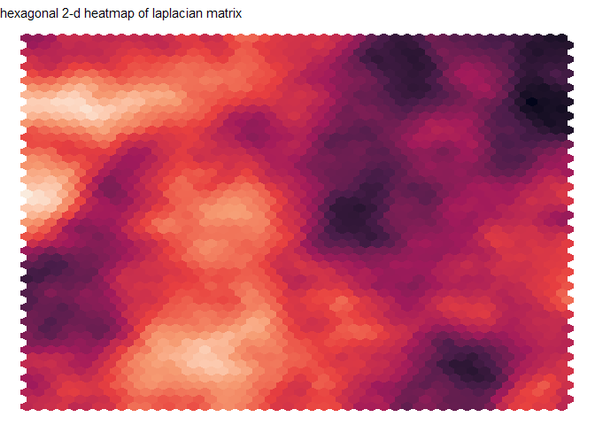
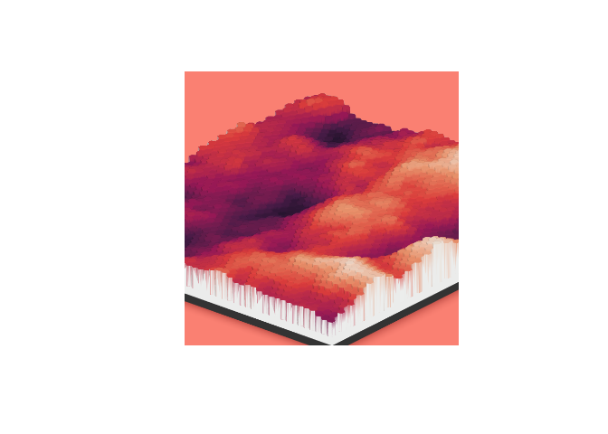
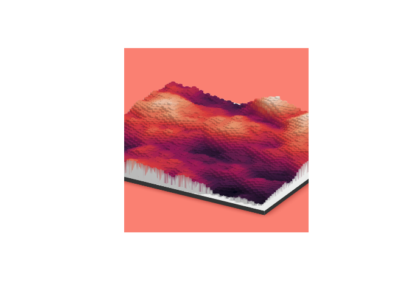

# waveshaders
frankiethull

why does this repo exist? To store some artsy rayshader examples with
chaotic julia simulations. i.e. how to dual wield Julia & R to make
beautiful graphics.

## waveshading?

**waveshading** was tagged in a few playful posts on my Twitter/X. This
related two systems: one in Julia, one in R.

Tested both Julia’s waterlily.jl and oceananigans.jl computational fluid
dynamics engines which allow chaotic fluid simulations. “rayshader” is a
3d plotting toolkit in R. Combining the two langs’ libs mainly for
funsies, trying out multiple esoteric open-source pkgs, & testing
multilingual quarto documents. As an added layer, examples below use
Arrow.jl to write the data, and arrow library in R to read in the data.

**Marrying the two together (Julia + R) sparked a lot of interest (“let
me see your code!”) type of requests on X. Not necessarily for
scientific reasons, but for artistic renderings of fluids!**

Below is a simple tutorial on running simulations in Julia and creating
visualizations in R. Whether it be terrain-based, fluid flows, cloud
physics, or whatever; there are a lot of cool artistic ways to leverage
rayshader + various tools from Python or Julia to make some really cool
renderings.

#### julia simulation code

let’s run some code in julia, then pass the results to R. Below we are
running a julia code-chunk.

Note, you can do any waterlily, oceananigans, or other julia example,
but this one is short and requires less domain knowledge.
https://docs.makie.org/stable/reference/plots/surface/

This example is borrowed from Makie documentation which seemed like a
better start for a tutorial. Instead of going all out on a fluid
simulation, we are going to simulate a single matrix. This is the best
starting point imo!

``` julia
# pkg setup for julia is pretty easy, example given:
# import Pkg; Pkg.add("package_name")

using SparseArrays
using LinearAlgebra
# using GLMakie


# This example was provided by Moritz Schauer (@mschauer).

# Define the precision matrix (inverse covariance matrix)
# for the Gaussian noise matrix.  It approximately coincides
# with the Laplacian of the 2d grid or the graph representing
# the neighborhood relation of pixels in the picture,
# https://en.wikipedia.org/wiki/Laplacian_matrix

function gridlaplacian(m, n)
    S = sparse(0.0I, n*m, n*m)
    linear = LinearIndices((1:m, 1:n))
    for i in 1:m
        for j in 1:n
            for (i2, j2) in ((i + 1, j), (i, j + 1))
                if i2 <= m && j2 <= n
                    S[linear[i, j], linear[i2, j2]] -= 1
                    S[linear[i2, j2], linear[i, j]] -= 1
                    S[linear[i, j], linear[i, j]] += 1
                    S[linear[i2, j2], linear[i2, j2]] += 1
                end
            end
        end
    end
    return S
end
```

    gridlaplacian (generic function with 1 method)

``` julia

# d is used to denote the size of the data
d = 150
```

    150

``` julia

 # Sample centered Gaussian noise with the right correlation by the method
 # based on the Cholesky decomposition of the precision matrix
data = 0.1randn(d,d) + reshape(
        cholesky(gridlaplacian(d,d) + 0.003I) \ randn(d*d),
        d, d
)
```

    150×150 Matrix{Float64}:
     -2.13805   -1.94965   -2.10359   …   -5.97555   -5.73233   -6.00414
     -1.02904   -1.04465   -1.68999       -5.93925   -5.84186   -5.79731
     -1.61541   -0.856065  -1.9808        -5.97519   -6.11237   -5.64964
     -1.57751   -1.39463   -1.7793        -5.04787   -4.80033   -5.20001
     -0.833541  -0.917326  -0.860234      -4.56373   -4.87722   -5.36495
     -0.544637  -0.580403  -1.63535   …   -4.42889   -5.00575   -4.96543
     -0.793416  -1.10866   -1.42821       -3.83051   -4.53027   -4.45252
     -1.16538   -1.0411    -1.19002       -3.53441   -3.36568   -3.39797
     -0.413468  -0.411806  -0.494561      -2.37381   -1.98162   -1.98826
      0.642052   0.317184   0.25955       -1.45563   -1.00251   -0.929579
      ⋮                               ⋱                        
      0.284687   1.51012    1.63325      -14.042    -13.4928   -13.7777
      0.534829   0.68485    0.599681     -13.6971   -14.1725   -14.2502
      1.35339    1.43253    1.37181      -14.4908   -14.974    -14.841
      1.42905    1.85022    2.04163      -15.3576   -15.3393   -15.2397
      0.89054    1.24337    1.01869   …  -15.3701   -14.9391   -14.4177
      0.114869   0.149387  -0.173205     -15.5042   -15.1111   -14.7342
     -1.11646   -0.191676  -0.892522     -14.6317   -14.7718   -15.1839
     -2.48818   -2.00189   -1.59932      -14.4368   -15.5093   -16.5131
     -3.22367   -2.81377   -2.71081      -15.6244   -15.7154   -16.6066

``` julia

# makie code is commented out, instead we will pass the data to R for rayshader.
# surface(data; shading = NoShading, colormap = :deep)
# surface(data; shading = NoShading, colormap = :deep)
```

convert the matrix to dataframe and save it off as an arrow file for R

``` julia
using Arrow 
using DataFrames

laplace_df = DataFrame(data, :auto)
```

    150×150 DataFrame
     Row │ x1          x2         x3         x4         x5         x6         x7   ⋯
         │ Float64     Float64    Float64    Float64    Float64    Float64    Floa ⋯
    ─────┼──────────────────────────────────────────────────────────────────────────
       1 │ -2.13805    -1.94965   -2.10359   -2.48174   -2.42099   -2.67788   -4.0 ⋯
       2 │ -1.02904    -1.04465   -1.68999   -2.11412   -2.44765   -3.29165   -4.1
       3 │ -1.61541    -0.856065  -1.9808    -2.59396   -2.52635   -3.53037   -4.6
       4 │ -1.57751    -1.39463   -1.7793    -2.81635   -3.41164   -3.8532    -4.5
       5 │ -0.833541   -0.917326  -0.860234  -1.9965    -2.57298   -2.8754    -3.5 ⋯
       6 │ -0.544637   -0.580403  -1.63535   -1.68791   -1.57463   -1.79414   -1.9
       7 │ -0.793416   -1.10866   -1.42821   -1.86227   -1.76905   -1.69462   -1.8
       8 │ -1.16538    -1.0411    -1.19002   -1.13643   -0.787755  -0.407784  -0.8
      ⋮  │     ⋮           ⋮          ⋮          ⋮          ⋮          ⋮           ⋱
     144 │  1.35339     1.43253    1.37181    1.74211    2.0665     3.00317    3.3 ⋯
     145 │  1.42905     1.85022    2.04163    1.33177    1.77917    2.20661    3.0
     146 │  0.89054     1.24337    1.01869    0.909277   1.36002    0.977153   1.7
     147 │  0.114869    0.149387  -0.173205  -0.191221  -0.261122  -0.414318   0.2
     148 │ -1.11646    -0.191676  -0.892522  -0.325694  -0.94129   -1.13833   -0.4 ⋯
     149 │ -2.48818    -2.00189   -1.59932   -1.85026   -1.5952    -1.69063   -0.9
     150 │ -3.22367    -2.81377   -2.71081   -1.97549   -2.05071   -2.14482   -1.2
                                                    144 columns and 135 rows omitted

``` julia

Arrow.write("laplacian.arrow", laplace_df)
```

    "laplacian.arrow"

#### R visualization code

next lets get the data setup in R for rayshader. There are a few ways to
do this. First load the df into a data.frame, then create an id for each
row-column and stretch it so it’s in a long format.

This will give us a lot of flexibility as we are going to use ggplot2
then convert the ggplot2 into a rayshader plot (if you are familiar with
ggplot2, this is a shortcut).

From there, xy binning to approximate the density of the surface (makes
a better visual imo). & 2-d hexagon bins work well.

``` r
library(dplyr)
```


    Attaching package: 'dplyr'

    The following objects are masked from 'package:stats':

        filter, lag

    The following objects are masked from 'package:base':

        intersect, setdiff, setequal, union

``` r
library(tidyr)
library(ggplot2)
```

    Warning: package 'ggplot2' was built under R version 4.3.2

``` r
library(rayshader)

# julia output
laplace_df <- arrow::read_ipc_file("laplacian.arrow")

# let's get this xy-matrix into a long df:
laplace_long_df <- laplace_df |>
                   mutate(
                     x_id = row_number()
                   ) |>
                    tidyr::pivot_longer(-x_id, names_to = "y_id", values_to = "z") |>
                    mutate(
                      y_id = gsub("x", "", y_id),
                      y_id = as.numeric(y_id)
                    )

# ggplot hex display:
gg <- 
laplace_long_df |>
    ggplot(aes(x = x_id, y = y_id, z = z)) +
  stat_summary_hex(fun = function(x) mean(x), bins = 45)  +
  scale_fill_viridis_c(option = 12) + 
  theme_void() +
  theme(legend.position = "none")

gg + labs(subtitle = "hexagonal 2-d heatmap of laplacian matrix")
```



creating the 3D-ified ggplot with rayshader:

``` r
plot_gg(gg, height=5, width=4.5, 
        phi   = 25, 
        zoom  = 0.4, 
        theta = -140, 
        background = "salmon")

render_snapshot(filename = "rayshader_v1.png")
```

display the snapshot:

``` r
magick::image_read("rayshader_v1.png") |> 
  plot()
```



adjusting phi, theta, and zoom:

``` r
plot_gg(gg, height=5, width=4.5, 
        phi   = 25, 
        zoom  = 0.5, 
        theta = 120, 
        background = "salmon")

render_snapshot(filename = "rayshader_v2.png")

magick::image_read("rayshader_v2.png") |> 
  plot()
```



from there, you can stitch multiple images together (if you have a delta
such as time or some other step function you are iterating over. Like
rotating phi or theta in a loop). If there are more than one file,
create a video from a list of saved png files like so:

fps \<- 10  
av::av_encode_video(file_list, ‘output.mp4’, framerate = fps)  
utils::browseURL(‘output.mp4’)

based on feedback will save off more complicated examples in an example
subfolder. But think this is the best starting point for running CFD in
Julia and shaders in R.

*To recreate the original Twitter post, see this example:*  
*https://clima.github.io/OceananigansDocumentation/stable/literated/convecting_plankton/*  
*original post:*  
*https://x.com/frankiethull/status/1744557482779742514?t=sgeF2vulucLE1h-xD9LJ1A&s=19*

Additional notes:  
my system has both julia and R installed on a windows machine. I have
RCall installed on Julia and JuliaCall installed on R. Julia is on my
env paths and this was ran using knitr via R, not a Julia Jupyter
kernel.
